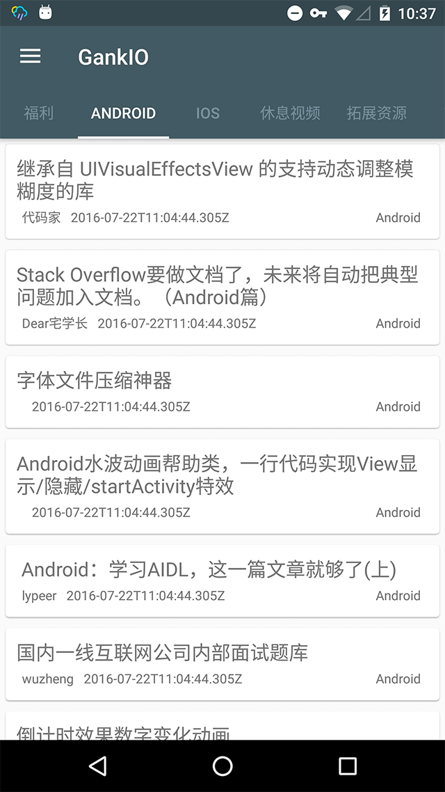

#GankIO

Gank.io第三方客户端，包含Gank.io所有的内容，RxJava+Retrofit2做网络请求，使用Glide作为图片加载框架。并使用了Material Design，浓浓的安卓风。（主要这项目是用来学习最近特火的新框架，大神轻喷。）

## Blog: 

#### [GankIO开发之路](http://www.luchenglong.com)

## Demo:  

&emsp;


## APK下载地址：

#### 1.Fir.im:[点击跳转](http://fir.im/GankIO)

## Gradle：
``` xml
compile 'xxx'
```

> 关于我，欢迎关注  
  博客：[点击跳转](http://www.luchenglong.com) 微信：[luchenglong](url) 微博：[@龙龙_童鞋](http://weibo.com/luchenglong12138)

## License
```
MIT License

Copyright (c) 2019 Chenglong.Lu

Permission is hereby granted, free of charge, to any person obtaining a copy
of this software and associated documentation files (the "Software"), to deal
in the Software without restriction, including without limitation the rights
to use, copy, modify, merge, publish, distribute, sublicense, and/or sell
copies of the Software, and to permit persons to whom the Software is
furnished to do so, subject to the following conditions:

The above copyright notice and this permission notice shall be included in all
copies or substantial portions of the Software.

THE SOFTWARE IS PROVIDED "AS IS", WITHOUT WARRANTY OF ANY KIND, EXPRESS OR
IMPLIED, INCLUDING BUT NOT LIMITED TO THE WARRANTIES OF MERCHANTABILITY,
FITNESS FOR A PARTICULAR PURPOSE AND NONINFRINGEMENT. IN NO EVENT SHALL THE
AUTHORS OR COPYRIGHT HOLDERS BE LIABLE FOR ANY CLAIM, DAMAGES OR OTHER
LIABILITY, WHETHER IN AN ACTION OF CONTRACT, TORT OR OTHERWISE, ARISING FROM,
OUT OF OR IN CONNECTION WITH THE SOFTWARE OR THE USE OR OTHER DEALINGS IN THE
SOFTWARE.
```
